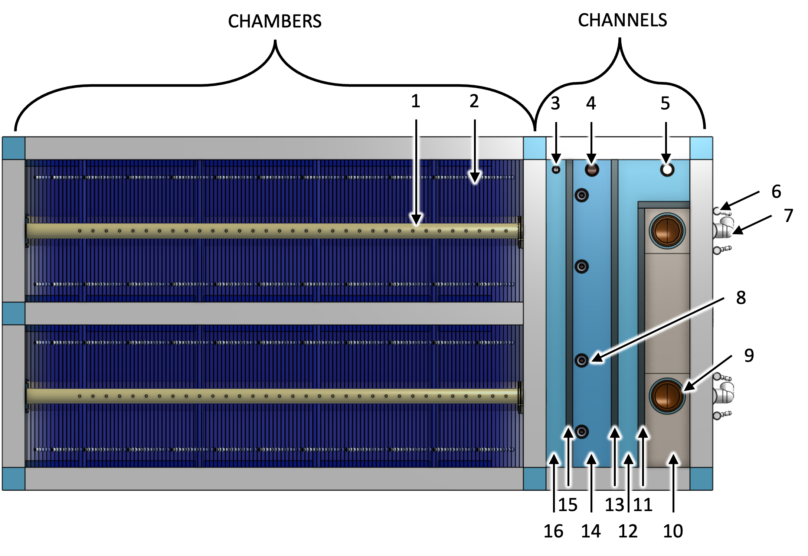
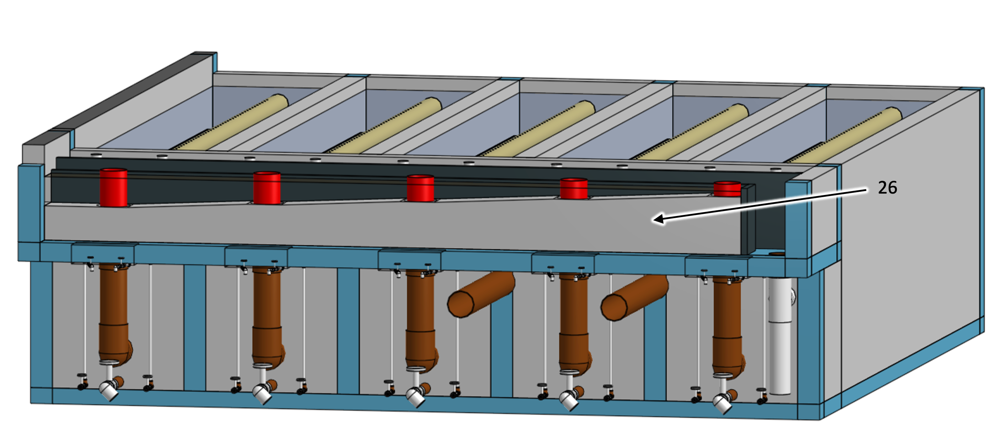

.. _title_Clarifier:

*********
Clarifier
*********

Design information for the AguaClara clarifier is available in `the Clarifier Design chapter of The Physics of Water Treatment Design <https://aguaclara.github.io/Textbook/Clarification/Clarifier_Design.html>`_.

Purpose and Description
=======================

The clarifier removes the majority of the particles and pathogens from the raw water source using two distinct mechanisms defined below. The goal is to concentrate the particles so they can be removed via drains.

#. Floc filter - Flocs that form a fluidized bed in the lower part of the clarifier are able to capture small particles as water flows through the porous flocs. 
#. Plate settlers -  Particles with a terminal velocity greater than the plate settler capture velocity (:sub:`($..clarifier.captureVm) no-sub`) settle unto the plates and then slide back down into the floc filter as an avalanche.

.. _figure_clarifier_top:

    Clarifier top view showing the channel system and two clarifier chambers. The chamber is where the floc filter and settlers are. 

.. _table_Clarifier_Key:

.. csv-table:: Clarifier Figure Key for :numref:`figure_clarifier_top`
    :header: "Key", "Name", "Purpose"
    :align: left
    :widths: 10 40 50
    :class: wraptable

 
    1, Outlet collector, Transports the clarified water out of the clarifier chamber 
    2, Plate settlers, Capture particles that have a terminal velocity greater than the capture velocity
    3, Outlet collector channel drain, Used during plant maintenance to allow operator to clean this channel
    4, Outlet channel drain, Allows operator to dump clarified water that doesn't meet specifications
    5, Inlet dump channel drain, Sends poorly flocculated water to the plant waste channel when the inlet collectors are blocked with pipe stubs
    6, Sludge bleed, Dumps flocs from the floc hopper cones to the plant drain channel
    7, Clarifier chamber drain, Drains the clarifier for maintenance
    8, Sludge hopper access port, Enables inserting a manual mixer into the floc hopper cone to fluidize the sludge when the sludge consolidates and does not flow as a liquid
    9, Inlet collector, Delivers flocculated water to the diffusers
    10, Inlet channel, Delivers flocculated water to the inlet collectors
    11, Inlet dump weir, Overflows when the inlet collectors are shut off to prevent poorly flocculated water from entering the clarifier
    12, Inlet dump channel, Dumps poorly flocculated water when the sludge consolidates and does not flow as a liquid
    13, Divider wall, Separates flocculated water from clarified water
    14, Outlet channel, Delivers clarified water to pipes carrying clarified water to the filters
    15, Outlet weir, Sets the height of water in the clarifiers and helps ensure equal flow distribution to all of the clarifier chambers
    16, Outlet collector channel, Merges the clarified water from all of the outlet collectors and ensures that all of the clarifier chambers have the same water level

.. _figure_clarifier_isometric:

.. figure:: Images/clarifier_isometric.png
    :width: 600px
    :align: center
    :alt: clarifier isometric view

    Clarifier isometric view showing the channel system and two clarifier chambers. Clarifier chambers operate in parallel. See :numref:`table_Clarifier_Key` for Figure Key.

.. _figure_clarifier_channel_system_photo:

.. figure:: Images/clarifier_channel_system_photo.png
    :width: 400px
    :align: center
    :alt: clarifier channel system photo

    Clarifier channel system photo. See :numref:`table_Clarifier_Key` for Figure Key.

.. _figure_clarifier_side_section:

.. figure:: Images/clarifier_side_section.png
    :width: 600px
    :align: center
    :alt: clarifier side section view

    Clarifier side section view showing the water flow path (blue arrows) and the floc flow path (brown arrows).

.. _table_Clarifier_Side_Key:
.. csv-table:: Clarifier Side View Figure Key for :numref:`figure_clarifier_side_section`
    :header: "Key", "Name", "Purpose"
    :align: left
    :widths: 10 40 50
    :class: wraptable

    17, Plate settler support frame, Supports the plate settler modules
    18, Inlet collector diffusers, Create a line jet that extends the full length of the clarifier chamber
    19, Jet reverser half pipe, Reverses the direction of the jets created by the diffusers so that the flow is vertically upward so it can resuspend flocs that have settled on the main chamber hopper
    20, Floc filter weir, Sets the depth of the floc filter in the main chamber
    21, Floc hopper cone, Concentrates the sludge before discharge
  

.. _figure_clarifier_front_section:

.. figure:: Images/clarifier_front_section.png
    :width: 600px
    :align: center
    :alt: clarifier front section view

    Clarifier front section view showing the floc flow path (brown arrows). See :numref:`table_Clarifier_Key` and :numref:`table_Clarifier_Side_Key` for Figure Keys.

.. _figure_clarifier_top_section:

.. figure:: Images/clarifier_top_section.png
    :width: 600px
    :align: center
    :alt: clarifier top section view

    Clarifier top section view showing plate settler support frame, floc weir, and floc hopper cones. See :numref:`table_Clarifier_Key` and :numref:`table_Clarifier_Side_Key` for Figure Keys.

.. _figure_clarifier_back_section:

.. figure:: Images/clarifier_back_section.png
    :width: 300px
    :align: center
    :alt: clarifier back section view

    Clarifier back section view showing the main chamber hopper, diffusers, and jet reverser half pipe. The diffuser jet is the jet created by the diffuser and its direction is reversed by the jet reverser.

.. csv-table:: Clarifier Back View Figure Key for :numref:`figure_clarifier_back_section`
    :header: "Key", "Name", "Purpose"
    :align: left
    :widths: 10 40 50
    :class: wraptable

 
    22, Main chamber hopper, Ensures that all flocs that settle to the bottom of the clarifier are resuspended by the diffuser jets 
    23, Main chamber water surface, Maximum water level in the main chamber is set by the outlet weir and the head loss through the outlet collector orifices
    24, Floc filter top surface, Marks the transition between the floc filter and the plate settlers

.. _figure_clarifier_inlet_collector:

.. figure:: Images/clarifier_inlet_collector.png
    :width: 300px
    :align: center
    :alt: clarifier inlet collector

    Downstream end of inlet collector showing diffusers.
    
.. _table_Diffuser_Figure_Key:
.. csv-table:: Diffuser Figure Key for :numref:`figure_clarifier_inlet_collector`
    :header: "Key", "Name", "Purpose"
    :align: left
    :widths: 10 40 50
    :class: wraptable
 
    25, Inlet collector air vent, Discharges air when the main chamber is being filled with water

.. _figure_clarifier_diffuser:

.. figure:: Images/clarifier_diffuser.png
    :width: 300px
    :align: center
    :alt: clarifier diffuser

    Diffuser showing isometric, side, and bottom views.

.. _figure_clarifier_inlet_steps:

    Clarifier view showing the steps in the inlet channel. The elevation increases from step to step.

.. csv-table:: Clarifier Inlet Steps Figure Key for :numref:`figure_clarifier_inlet_steps`
    :header: "Key", "Name", "Purpose"
    :align: left
    :widths: 10 40 50
    :class: wraptable
 
    26, Inlet channel steps, Increases the elevation of water into each inlet manifol

Plant Specifications
=====================

.. _table_Clarifier_Design:

.. csv-table:: Clarifier Design Inputs
    :header: "Parameter", "Value"
    :align: left
    :widths: 80 20
    :class: wraptable

    **Inputs**
    Maximum velocity gradient, :sub:`($..clarifier.G_max) no-sub`
    Maximum upflow velocity, :sub:`($..clarifier.upVm) no-sub`
    Capture velocity, :sub:`($..clarifier.captureVm) no-sub`
    Maximum temperature, :sub:`($..clarifier.TEMP_max) no-sub`
    Minimum temperature, :sub:`($..clarifier.TEMP_min) no-sub`

.. _table_Clarifier_Civil_Construction_Parameters:

.. csv-table:: Clarifier Civil Construction Parameters for :numref:`figure_clarifier_top`-:numref:`figure_clarifier_inlet_steps`
    :header: "Key", "Parameter", "value"
    :align: left
    :widths: 10 60 30
    :class: wraptable

    "", Overall clarifier width, :sub:`($..plant.clarifier.OW) no-sub`
    "", Overall clarifier length, :sub:`($..clarifier.OL) no-sub`
    "", Height of clarifier measured from the bottom of the jet reverser, :sub:`($..clarifier.H ) no-sub`
    "", Number of clarifier chambers (duty/spare), :sub:`($..clarifier.bay.N) no-sub` / :sub:`($..plant.clarifier.spare) no-sub`
    "", Inside width of each chamber, :sub:`($..clarifier.bay.W) no-sub`
    "", Inside length of each chamber, :sub:`($..clarifier.bay.L) no-sub`
    "", Main chamber hopper angle, :sub:`($..clarifier.slopeAN) no-sub`
    "3", Outlet collector channel drain nominal diameter, :sub:`($..clarifier.channels.dump.clarifiedPreWeirND) no-sub` inch
    "4", Outlet channel drain nominal diameter, :sub:`($..clarifier.channels.dump.ND) no-sub` inch
    "5", Inlet dump channel drain nominal diameter, :sub:`($..clarifier.channels.dump.ND) no-sub` inch
    "10&14", Channel wall height, :sub:`($..clarifier.channels.tank.H) no-sub`
    "26", Channel elevation increase per outlet,  :sub:`($..clarifier.channels.inletPreWeirDeltaH) no-sub`
    "10", **Inlet channel**, ""
    "", Width, :sub:`($..clarifier.channels.inletPreWeirW) no-sub`
    "", Maximum velocity, :sub:`($..clarifier.channels.inletPreWeirV_max) no-sub`
    "11", Inlet dump weir height, :sub:`($..clarifier.channels.inletWeir.W) no-sub`
    "12", Inlet dump channel width, :sub:`($..clarifier.channels.inletPostWeirW) no-sub`
    "14", Outlet channel width, :sub:`($..clarifier.channels.outletPostWeirW) no-sub`
    "15", Outlet collector weir height, :sub:`($..clarifier.channels.outletWeirH) no-sub`
    "16", Outlet collector channel width, :sub:`($..clarifier.channels.outletPreWeirW) no-sub`
    "", **Floc Hopper**, ""
    "", Floc hopper access port nominal diameter, :sub:`($..clarifier.hopperPort.ND) no-sub` inch
    "20", Floc hopper weir height, :sub:`($..clarifier.hoppers.concreteWeirH) no-sub`
    "21", **Floc hopper cone**, ""
    "", Floc hopper cone angle, :sub:`($..clarifier.hoppers.slopeAN) no-sub`
    "", Floc hopper cone height, :sub:`($..clarifier.hoppers.coneH) no-sub`
    "", Floc hopper cone top diameter, :sub:`($..clarifier.hoppers.hopperD) no-sub`
    
.. _table_Clarifier_Hydraulic_Parameters:

.. csv-table:: Clarifier Hydraulic Parameters for :numref:`figure_clarifier_top`-:numref:`figure_clarifier_inlet_steps`
    :header: "Key", "Parameter", "Value"
    :align: left
    :widths: 10 60 30
    :class: wraptable

    "", Maximum flow rate per chamber, :sub:`($..clarifier.bayPlastic.inletManifold.manifold.Qm_max) no-sub`
    "9", **Inlet Collector**, ""
    "", Head loss from inlet to diffuser exit, :sub:`($..clarifier.bayPlastic.inletManifold.manifold.HL) no-sub`
    "", Nominal diameter, :sub:`($..clarifier.bayPlastic.inletManifold.manifold.ND) no-sub` inch
    "", Total length, :sub:`($..clarifier.bayPlastic.inletManifold.manifold.pipeL) no-sub`
    "", Air vent diameter (one air vent per collector), :sub:`($..clarifier.bayPlastic.inletManifold.manifold.ventD) no-sub`
    "", Diameter of molded section of the diffuser that fits into the manifold, :sub:`($..clarifier.bayPlastic.inletManifold.manifold.orificeD) no-sub`
    "18", **Diffusers**, ""
    "", Nominal diameter, :sub:`($..clarifier.bayPlastic.inletManifold.diffuser.ND) no-sub` inch
    "", Reduced outer diameter for insertion into manifold,  :sub:`($..clarifier.bayPlastic.inletManifold.diffuser.reducedOD) no-sub`
    "", Total length,  :sub:`($..clarifier.bayPlastic.inletManifold.diffuser.diffuserL) no-sub`
    "", Diffusers per inlet manifold, :sub:`($..clarifier.bayPlastic.inletManifold.manifold.orificeN) no-sub`
    "", Port diameter in manifold for diffusers, :sub:`($..clarifier.bayPlastic.inletManifold.manifold.orificeD) no-sub`
    "", Center to center distance for diffusers, :sub:`($..clarifier.bayPlastic.inletManifold.manifold.orificeB) no-sub`
    "", Distance to center of last diffuser from downstream end of manifold,  :sub:`($..clarifier.bayPlastic.inletManifold.manifold.orificeStartB) no-sub`
    "", Slot inner width,  :sub:`($..clarifier.bayPlastic.inletManifold.diffuser.slotW) no-sub`
    "", Slot inner length,  :sub:`($..clarifier.bayPlastic.inletManifold.diffuser.slotL) no-sub`
    "", Expansion angle, :sub:`($..clarifier.bayPlastic.inletManifold.diffuser.loftAN) no-sub`
    "", Diffuser jet maximum velocity gradient,  :sub:`($..clarifier.bayPlastic.inletManifold.diffuser.G_jet) no-sub`
    "", Diffuser jet maximum velocity,  :sub:`($..clarifier.bayPlastic.inletManifold.diffuser.V_max) no-sub`
    "", Diffuser jet head loss,  :sub:`($..clarifier.bayPlastic.inletManifold.diffuser.HL) no-sub`
    "19", **Jet reverser half pipe**, ""
    "", Nominal diameter, :sub:`($..clarifier.bayPlastic.reverser.ND) no-sub` inch
    "9", **Outlet Collector**, ""
    "", Outlet collector head loss (from orifice inlet to outlet), :sub:`($..clarifier.bayPlastic.outletManifold.HL) no-sub`
    "", Nominal diameter, :sub:`($..clarifier.bayPlastic.outletManifold.ND) no-sub` inch
    "", Air vent diameter, :sub:`($..clarifier.bayPlastic.outletManifold.ventD) no-sub`
    "", Orifice diameter, :sub:`($..clarifier.bayPlastic.outletManifold.orificeD) no-sub`
    "", Orifice center to center spacing, :sub:`($..clarifier.bayPlastic.outletManifold.orificeB) no-sub`
    "6", **Sludge drains**, ""
    "", Sludge drain nominal diameter, :sub:`($..clarifier.hoppers.sludgeDrain.ND) no-sub` inch
    "", Sludge bleed valve nominal diameter, :sub:`($..clarifier.hoppers.sludgeBleed.ND) no-sub` inch
    "2", **Plate Settlers**, ""
    "", Length, :sub:`($..clarifier.bayPlastic.plate.L) no-sub`
    "", Width, :sub:`($..clarifier.bayPlastic.plate.W) no-sub`
    "", Angle from the horizontal, :sub:`($..clarifier.bayPlastic.plate.AN) no-sub`
    "", Space between plates, :sub:`($..clarifier.bayPlastic.plate.S) no-sub`
    "", Overlap - extra width compared with tank width,  :sub:`($..clarifier.bayPlastic.plate.overlapW) no-sub`
    "", Number of plate settler modules,  :sub:`($..clarifier.bayPlastic.settler.moduleN) no-sub`
    "", Number of plates per settler module,  :sub:`($..clarifier.bayPlastic.settler.plateN) no-sub`
    "", Number of plates in the last settler module,  :sub:`($..clarifier.bayPlastic.settler.lastPlateN) no-sub`
