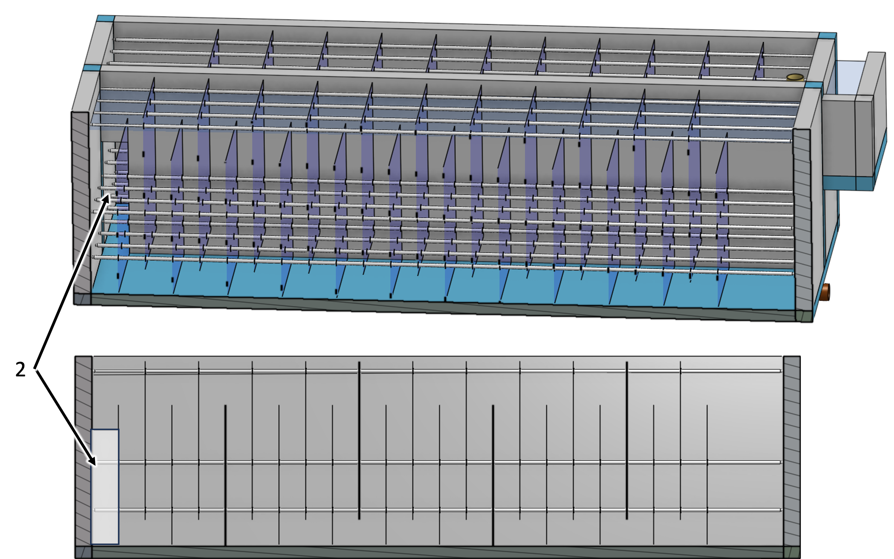
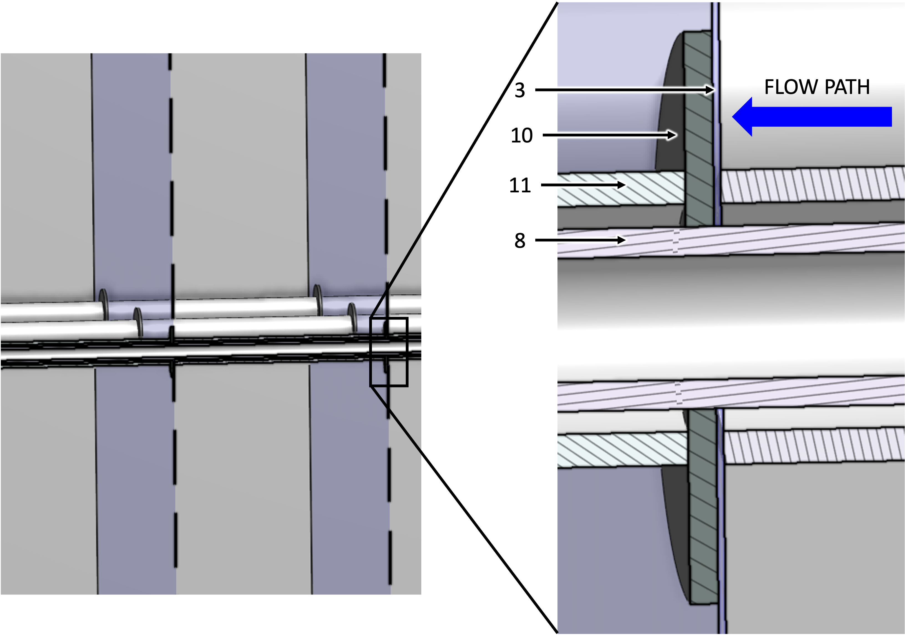

.. _title_Flocculator:

***********
Flocculator
***********

Design information for the AguaClara flocculator is available in the `Flocculation Design chapter of The Physics of Water Treatment Design <https://aguaclara.github.io/Textbook/Flocculation/Floc_Design.html>`_.

Purpose and Description
=======================

The flocculator causes particles suspended in the water to collide and agglomerate to form larger aggregates called flocs. These flocs have enough weight to settle easily in the clarifier. The gentle mixing of water with coagulant in the flocculator causes collisions between particles.

This flocculator is a series of channels with sheets or baffles that direct the flow of water in a serpentine path. As the water goes around the end of a baffle the flow first contracts and then expands. This turbulent expansion causes fluid deformation and ultimately promotes collisions between particles.

.. _figure_flocculator_w_flow_path:

.. figure:: Images/flocculator_w_flow_path.png
    :width: 600px
    :align: center
    :alt: flocculator with flow path

    View of an AguaClara flocculator with one wall removed. Blue arrows indicate the direction of water flow between the baffles.

.. csv-table:: Flocculator Figure Key for :numref:`figure_flocculator_w_flow_path`
    :header: "Key", "Description"
    :align: left
    :widths: 20 80
    :class: wraptable

    "1", "Water surface that slopes downward in the direction of flow" 
    "2", "Flocculator port through the channel wall for flow to pass into the next channel"
    "3", "Lower baffle"
    "4", "Upper baffle"
    "5", "Location where water enters this channel through the hidden wall"
    "6", "Pipe stub that can be removed to drain the flocculator"
    "7", "Channel connecting the flocculator to the clarifier"

.. _figure_floc_port:

    View of an AguaClara flocculator highlighting a flocculator port

.. csv-table:: Flocculator Port Figure Key for :numref:`figure_floc_port`
    :header: "Key", "Description"
    :align: left
    :widths: 20 80
    :class: wraptable

    "2", "Flocculator channel port"

.. _figure_floc_baffle_module:

.. figure:: Images/floc_baffle_module.png
    :width: 600px
    :align: center
    :alt: flocculator baffle module

    Photo of AguaClara modular baffle assembly

The above assembly (:numref:`figure_floc_baffle_module`) simplifies both fabrication and maintenance. The baffle assembly can be elevated, as shown in the assembly on the right, to allow water to flow under the baffles during flocculator cleaning and during filling and emptying.

.. csv-table:: Flocculator Baffle Photo Figure Key for :numref:`figure_floc_baffle_module`
    :header: "Key", "Description"
    :align: left
    :widths: 20 80
    :class: wraptable

    "3", "Upper polycarbonate baffle"
    "8", "PVC pipe frame"
    "9", "Temporary pipes used to elevate a baffle assembly while the flocculator is filled with water"

.. _figure_floc_baffle_spacer_detail:

    Baffle spacer detail
    
In :numref:`figure_floc_baffle_spacer_detail`, the washer is located downstream of the polycarbonate baffle so that the force of the water on the baffle is first transferred to the washer before being transferred to the pipe spacer to reduce the forces applied near the hole through the baffle.

.. csv-table:: Baffle/Spacer Detail Figure Key for :numref:`figure_floc_baffle_spacer_detail`
    :header: "Key", "Description"
    :align: left
    :widths: 20 80
    :class: wraptable
   
    "3", "Polycarbonate baffle" 
    "8", "Frame pipe that connects everything together"
    "10", "Plastic washer"
    "11", "Spacer pipe that sets the spacing between baffles"

Plant Specifications
=====================

.. _table_Flocculator_Civil_Construction_Parameters:

.. csv-table:: Flocculator Civil/Pipe Specifications for :numref:`figure_flocculator_w_flow_path`-
    :header: "Key", "Parameter", "Value"
    :align: left
    :widths: 20 50 30
    :class: wraptable

    "", **Channels**, ""
    "", Channel length, :sub:`($..floc.L) no-sub`
    "", Channel width, :sub:`($..floc.channelW) no-sub`
    "", Channel wall height, :sub:`($..floc.H) no-sub`
    "", Number of channels, :sub:`($..floc.channelN) no-sub`
    "2", **Ports**, ""
    "", Height of port between channels, :sub:`($..floc.channelW) no-sub`
    "", Width of port between channels, :sub:`($..floc.baffle.S) no-sub`
    "3 & 4", **Baffles**, ""
    "", Number of baffle spaces per channel,  :sub:`($..floc.baffle.spacesN) no-sub`
    "", Baffle extra width for improved water seal,  :sub:`($..floc.baffleSet.baffle.overlapW) no-sub`
    "", Separation between baffles, :sub:`($..floc.baffle.S) no-sub`
    "3", Height of lower baffles, :sub:`($..floc.baffleSet.baffle.bafflebottomL) no-sub`
    "4", Height of upper baffles, :sub:`($..floc.baffleSet.baffle.baffletopL) no-sub`
    "6", Drain nominal diameter,   :sub:`($..floc.drain.ND) no-sub`
    "8", Baffle frame nominal diameter,    :sub:`($..floc.baffleSet.baffle.frame.ND) no-sub`
    "11", Baffle spacers nominal diameter,   :sub:`($..floc.baffleSet.baffle.spacer.ND) no-sub`

.. _table_Flocculator_Hydraulic_Parameters:

.. csv-table:: Flocculator Hydraulic Specifications
   :header: "Parameter", "Value"
   :align: left
   :widths: 50 50
   :class: wraptable

    Collision potential G :math:`\theta`,  :sub:`($..floc.GT) no-sub`
    Average velocity gradient G,  :sub:`($..floc.G) no-sub`
    Minimum water temperature,   :sub:`($..floc.TEMP_min) no-sub`
    Maximum water viscosity,   :sub:`($..floc.NU) no-sub`
    Water volume,   :sub:`($..floc.VOL) no-sub`
    Minimum retention time,  :sub:`($..floc.TI) no-sub`
    Depth of water at exit,  :sub:`($..floc.outletHW) no-sub`
    Total head loss at maximum design flow,  :sub:`($..floc.HL_max) no-sub`
    Average water velocity,   :sub:`($..floc.V) no-sub`
    Baffle minor loss coefficient,   :sub:`($..floc.baffleK) no-sub`
    Baffle H/S ratio,   :sub:`($..floc.HS_pi) no-sub`