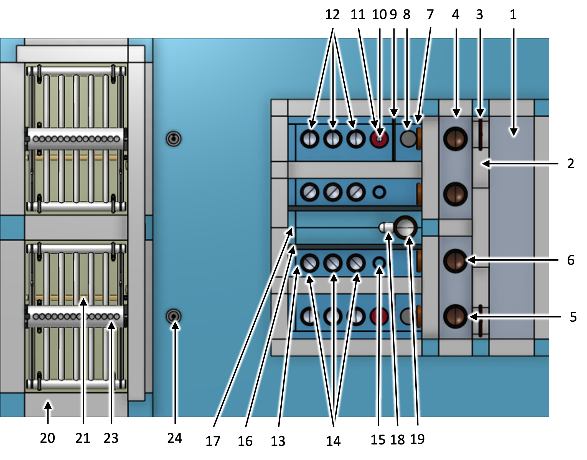
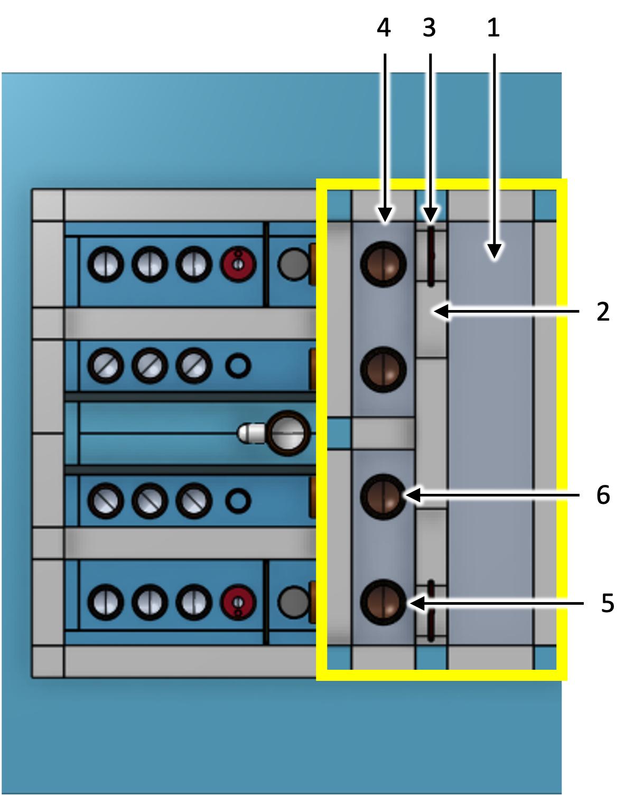
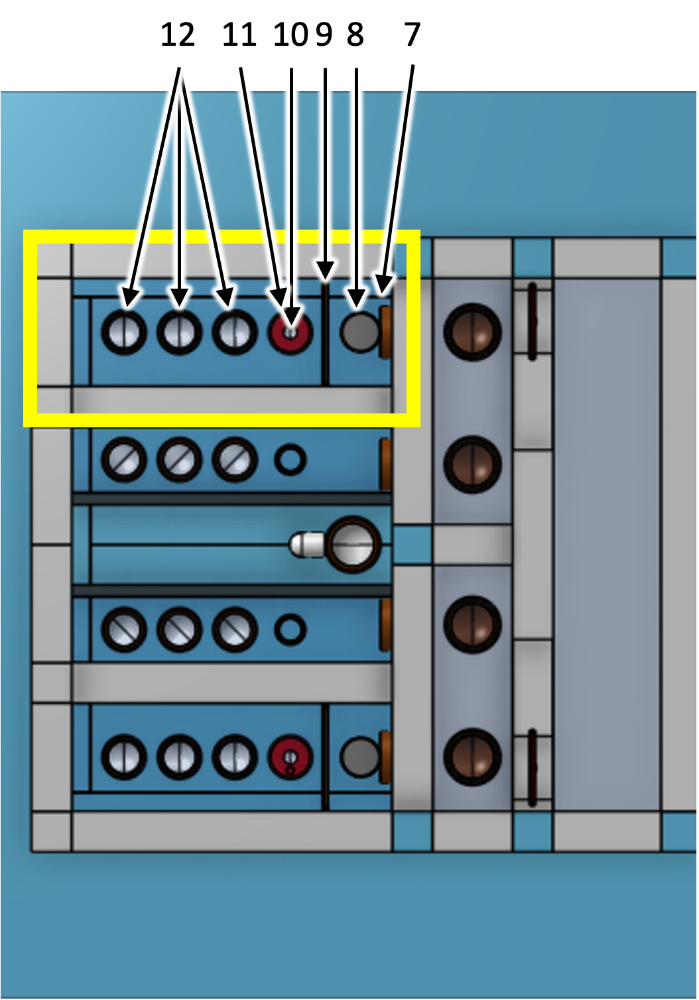
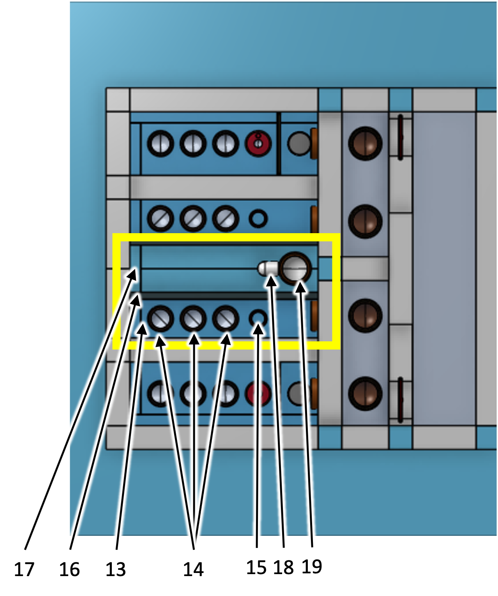
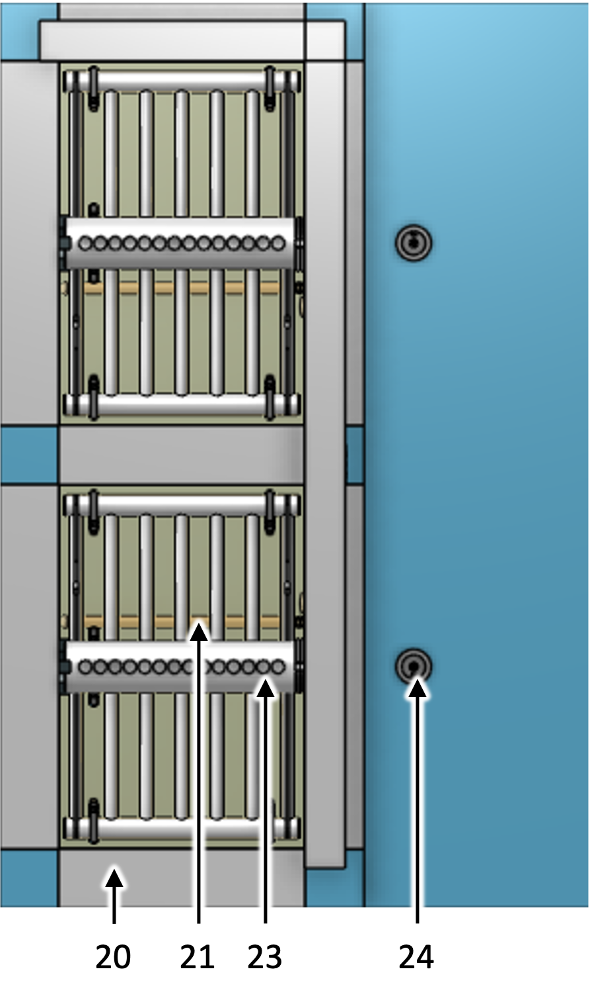

.. _title_StaRS:

*************************
Stacked Rapid Sand Filter
*************************

Design information for the AguaClara Stacked Rapid Sand Filter (StaRS) is available in `the Open Stacked Rapid Sand Filter Design chapter of The Physics of Water Treatment Design <https://aguaclara.github.io/Textbook/Filtration/Filtration_Design.html>`_.

Purpose and Description
=======================

The StaRS filter removes particles and pathogens from the clarified water. The StaRS filter was designed to eliminate the need for pumps and storage tanks that are normally required for backwashing rapid sand filters. The StaRS filter has the same flow rate in filtration mode and in backwash mode. An elegant filter hydraulic design enables switching from filtration mode to backwash mode without using any large diameter valves. Backwash is accomplished using clarified water and that increases the efficiency of water production by the AguaClara plant. 

The hydraulic controls are on the main plant floor and are open so that the plant operators can readily observe head loss through the filter as well as the turbidity of the clarified and filtered water. 

.. _figure_filter_top:

    Top view of filter showing filter hydraulic controls and filter chambers separated by a walkway

.. _figure_filter_isometric:

.. figure:: Images/filter_isometric.png
    :width: 600px
    :align: center
    :alt: filter isometric view

    Filter isometric view with filter wall and backwash tank wall removed, showing the filter internal piping and the pipes that connect the filter controls to the filter chamber

.. _figure_filter_left_section_isometric:

.. figure:: Images/filter_left_section_isometric.png
    :width: 600px
    :align: center
    :alt: filter left section isometric view

    Filter left section isometric view showing how the inlet tank, filter chamber, and siphon pipe are all aligned 
    
In :numref:`figure_filter_left_section_isometric`, the four inlet pipes have a straight path into the filter chamber. The outlet pipes have a 45° elbow to account for the offset to the filter controls outlet tank. The different heights of the inlet pipe stubs in the inlet tank are also shown.

.. _figure_filter_controls_top_isometric:

.. figure:: Images/filter_controls_top_isometric.png
    :width: 600px
    :align: center
    :alt: filter controls top isometric view

    Filter controls top isometric view
    
The filter controls provide the operator with a method to rapidly confirm filter operation. The filter controls come in pairs when there is more than one filter chamber so they can share the finished water tank. 

.. _figure_filter_distribution:

    
    Top view of distribution to the filter inlet tanks

.. _table_Distribution_to_the_filter_inlet_tanks:
.. csv-table:: Distribution to the Filter Inlet Tanks Figure Key for :numref:`figure_filter_distribution`
    :header: "Key", "Name", "Purpose"
    :align: left
    :widths: 10 25 65
    :class: wraptable

    1, Inlet channel, Receives the water from :sub:`($..filter.pipes.clarified.N) no-sub` clarified water pipe coming from the clarifier and distributes the water to :sub:`($..filter.fiPipes.bay.N) no-sub` filter chambers
    2, Wide weir, Uses head loss to divide the flow equally between the filter chambers 
    3, Removable gate, Can be removed to provide full design flow to a filter during backwash
    4, Bypass channel, Provides option to bypass the filter by swapping the LFOM and bypass pipes
    5, LFOM, Measures the flow rate into the filter
    6, Bypass pipe, Pipe stub that can be swapped with the LFOM to bypass the filter

.. _figure_filter_inlet_tank:

    
    Top view of filter inlet tank

.. _table_filter_inlet_tank:
.. csv-table:: Filter Inlet Tank Figure Key for :numref:`figure_filter_inlet_tank`
    :header: "Key", "Name", "Purpose"
    :align: left
    :widths: 10 25 65
    :class: wraptable

    7, Inlet tank, Distributes the clarified water to the 4 filter inlets
    8, Overflow, Automatically diverts clarified water to the filter pipe gallery to waste or recycle when the filter head loss exceeds the maximum design value
    9, Bubble weir, "Lifts bubbles to prevent them from entering the inlets to the filter, releasing them to the surface"
    10, Backwash orifice plate, Adds head loss to filter inlet 1 during filtration so that it has the same head loss as the other inlets and is removed during backwash
    11, Backwash trunk, Delivers water from the inlet tank to the filter chamber during filtration and during backwash
    12, Inlet trunks, Delivers water from the inlet tank to the filter chamber during filtration

.. _figure_filter_outlet_tank:

    
    Top view of filter outlet tank

.. _table_Filter_outlet_tank:    
.. csv-table:: Filter Outlet Tank Figure Key for :numref:`figure_filter_outlet_tank`
    :header: "Key", "Name", "Purpose"
    :align: left
    :widths: 5 25 62
    :class: wraptable

    13, Outlet tank, Collects filtered water from the 3 outlet trunks
    14, Outlet trunks, Deliver water from the filter chamber to the outlet tank during filtration
    15, Filter to waste, Dumps filtered water to the pipe gallery. Operators can remove the pipe stub after backwash to waste filtered water that doesn't meet treatment standards.
    16, Filtered water weir, "Enables filtering to waste. There is a pipe to waste that with a pipe stub in it before the weir, so when the pipe stub is pulled out, flows to waste instead of going over the weir."
    17, Finished water tank, Adds chlorine to the filtered water and delivers the water to the finished water pipe
    18, Chlorination conduit, Provides a path for a chlorination tube to drip into the water exiting from one of the filters
    19, Finished water pipe, Delivers the finished water to the community water storage tank

.. _figure_filter_controls_inlet_tank:

.. figure:: Images/filter_controls_inlet_tank.png
    :width: 600px
    :align: center
    :alt: filter controls inlet tank
    
    Isometric view of filter controls inlet tank. The backwash orifice plate is in place for filtration mode. 

In the filter, water flows from right to left from the inlet channel, over the wide weir to the bypass channel. During normal operation, the water enters the LFOM and flows into the filter controls inlet tank above. If there is a need to bypass a filter, the LFOM and bypass pipe stubs are simply swapped. During backwash, the gate can be removed so that the filter receives the design flow rate. The filter controls inlet tank has an overflow that dumps water to the backwash tank when the head loss through the filter exceeds the maximum design value. The bubble weir raises bubbles to minimize their entry into the filter inlets. The short pipe stubs in the filter inlets ensure that the water all enters the backwash inlet during backwash. The different heights of the pipe stubs causes the filter sand to fluidize gradually starting from the sand near the top of the filter and progressing deeper as more of the water is forced into the bottom inlets.

Water exits the filter chamber through three outlet pipes and then enters the filter controls outlet tank (:numref:`figure_filter_controls_outlet_tank_section`). After backwash, the red pipe stub can be removed as shown in the foreground outlet tank to enable filtering to waste. When not filtering to waste, the water flows over the filtered water weir into the finished water tank and finally into the finished water pipe.

.. _figure_filter_chamber_siphon:

    Top view of filter chamber and siphon

.. _table_Filter_chamber:    

.. csv-table:: Filter Chamber and Siphon Figure Key for :numref:`figure_filter_chamber_siphon`
    :header: "Key", "Name", "Purpose"
    :align: left
    :widths: 5 25 62
    :class: wraptable

    20, Filter chamber, Contains the filter internal piping and filter sand
    21, Filter chamber drain, Drains water for maintenance operations 
    22, Sand dump pipe, Empties the sand from the filter
    23, Siphon pipe, Discharges backwash to the pipe gallery to waste or for recycle
    24, Siphon air valve, Controls the siphon and switches the filter between filtration and backwash
    25, Siphon water seal, Prevents the water from exiting the siphon at the end of the backwash
    26, Sand, Provides the filter media and pore structure for capture of flocs and particles

.. _figure_filter_controls_outlet_tank_section:

.. figure:: Images/filter_controls_outlet_tank_section.png
    :width: 600px
    :align: center
    :alt: filter controls outlet tank section

    Filter controls outlet tank section showing water levels
    
The outlet tank in the foreground of :numref:`figure_filter_controls_outlet_tank_section` has the pipe stub that enables filter to waste removed. The outlet tank in the background has the pipe stub in place to prevent filtering to waste.

.. _figure_filter_internal_piping_isometric:

.. figure:: Images/filter_internal_piping_isometric.png
    :width: 600px
    :align: center
    :alt: filter internal piping isometric

    Isometric view of filter internal piping showing how the modules, siphon, and filter drain are placed in the filter chamber 
    
The filter interal piping serves to divide the sand bed into :sub:`($..filter.layerN) no-sub` layers. The flow through each layer alternates direction with the bottom layer flowing upward and the next layer flowing downward. 

:numref:`figure_filter_internal_piping_modules` shows how the modules stack. The modules are prevented from lifting by cables anchored to the concrete slab, and attach to the pipes embedded in the filter chamber wall. This filter internal piping consists of 7 modules for easy assembly in the filter chamber. A module includes the internal sand filter piping in the same plane connected to inlet/outlet trunk. Each module stacks on top of the module below. The tie-down cable ensures that the modules can not shift relative to each other and it also clamps the entire set of modules in place to prevent uplift during backwash initiation. 

.. _figure_filter_internal_piping_modules:

.. figure:: Images/filter_internal_piping_modules.png
    :width: 600px
    :align: center
    :alt: filter internal piping modules

    Detail isometric view of filter internal piping modules 
    

.. _table_Filter_internal_piping:    

.. csv-table:: Filter Internal Piping Figure Key for :numref:`figure_filter_internal_piping_modules`
    :header: "Key", "Name", "Purpose"
    :align: left
    :widths: 10 25 65
    :class: wraptable

    27, Band clamps, Attach the trunks to the pipes that are embedded in the filter tank chamber wall
    28, Winged branch pipes, Injects clarified water into the sand bed
    29, Slotted branch pipes, Extracts filtered water from the sand bed
    30, Receptor pipes, Terminate and support the winged and slotted branch pipes
    31, Trunk spacer, Supports the end of the trunks
    32, Receptor spacer, Supports the receptors
    33, Anchor bolts, Connects the cable to the concrete slab
    34, Cable, Prevents the internal pipe modules from lifting during backwash initation
    35, Hose clamp, "Tightens all of the connections between branches, receptors, and trunks to prevent sand leaks"

.. _figure_filter_trunk_isometric:

.. figure:: Images/filter_trunk_isometric.png
    :width: 600px
    :align: center
    :alt: filter trunk isometric

    Filter inlet trunk isometric view
    
:numref:`figure_filter_trunk_isometric` shows the ports for the branches and the band clamp system that attaches to a pipe embedded in the filter chamber wall. This main trunk pipe in each module is connected to the embedded pipe that connects to either the filter control inlet tank or filter control outlet tank. The pipes are connected by a stainless steel band that is then held in place with two hose clamps. The ports for the branches are slightly smaller than the outside diameter of the branches so that the molded end of the branches can only be inserted a fixed distance into the trunk. 

.. _figure_filter_trunk_spacer_front_and_top:

.. figure:: Images/filter_trunk_spacer_front_and_top.png
    :width: 200px
    :align: center
    :alt: filter trunk spacer front and top views

    Filter trunk spacer front and top views
    
The :sub:`($..filter.layerH) no-sub` spacing of the trunks and receptors is set by the spacers. The cable grooves alternate sides on the spacers so that the cables prevent the spacers from moving. The spacers are attached to the trunks and receptors.

.. _figure_filter_receptor_isometric:

.. figure:: Images/filter_receptor_isometric.png
    :width: 600px
    :align: center
    :alt: filter receptor isometric

    Filter inlet receptor isometric showing the ports for the branches 
    
The receptors are symmetrical and have PVC disks that plug both ends. The compact design of the PVC disks enables the first and last branches to be relatively close to the filter chamber walls.

.. _figure_filter_inlet_branches:

.. figure:: Images/filter_inlet_branches.png
    :width: 600px
    :align: center
    :alt: filter inlet branches

    Examples of different types/views of filter inlet branches. From top to bottom, a backwash branch (bottom view), a middle inlet branch (bottom view), top inlet branch (bottom view), and top inlet branch (side view).

There are three types of inlet branches, shown above. The bottom backwash branches have the most orifices to be able to handle the high backwash flow rate. This results in the backwash branches having insufficient head loss during normal filtration. To accommodate the low backwash branch head loss, an orifice plate is added to the backwash inlet during filtration. The middle two inlet modules both deliver clarified water to two sand layers and thus have at least twice as many orifices as the top inlet branches. The middle inlets have even more orifices to account for the added head loss in the inner trunks given that the inner trunks have double the flow rate of the top and bottom trunks during filtration. The ends of the branches are molded to create a sand-tight connection with the trunk and receptor pipes. 

.. _table_Filter_appurtenances:    

.. csv-table:: Filter Appurtenances Figure Key
    :header: "Key", "Name", "Purpose"
    :align: left
    :widths: 10 25 65
    :class: wraptable

    36, Sand tank, "Receives, drains, and temporarily stores filter sand during filter maintenance operations"
    37, Sand tank overflow weir, Excess water discharges over this weir
    38, Slotted sand drain, Discharges water from the sand
    39, Sand tank overflow drain, Discharges overflow water from the sand tank
    40, Pipe gallery and filter backwash water tank, Option to use this tank to enable recycle of backwash water 
    41, Pipe gallery drain, Discharges water from the pipe gallery

Plant Specifications
=====================

.. _table_Distribution_to_the_filter_inlet_tanks_design_parameters:

.. csv-table:: Distribution to the filter inlet tanks design parameters for :numref:`figure_filter_distribution` |filter_distribution_icon|
    :header: "Key", "Name", "Value"
    :align: left
    :widths: 10 55 35
    :class: wraptable
   
    1, **Inlet channel**, 
     , Water depth, :sub:`($..filter.ioControls.ioChannelsHW) no-sub`
     , Width, :sub:`($..filter.ioControls.inletW) no-sub`
     , Height, :sub:`($..filter.ioControls.ioChannelsH) no-sub``
    2, **Wide weir**, 
     , Height, :sub:`($..filter.ioControls.wideWeir.H) no-sub`
     , Width, :sub:`($..filter.ioControls.wideWeir.W) no-sub`
     , Maximum head loss, :sub:`($..filter.ioControls.inletWeirHL) no-sub`
    3, **Removable gate**
     , Height, :sub:`($..filter.ioControls.gateOpening.H) no-sub`
     , Width, :sub:`($..filter.ioControls.gateOpening.W) no-sub`
    4, **Bypass channel**,
     , Width, :sub:`($..filter.ioControls.bypassW) no-sub`
    5, **LFOM**,
     , Nominal diameter, :sub:`($..filter.ioControls.lfom.ND) no-sub` inch
     , SDR, :sub:`($..filter.ioControls.lfom.SDR) no-sub`
     , Number of rows of orifices, :sub:`($..filter.ioControls.lfom.rowN) no-sub`
     , Maximum flow rate, :sub:`($..filter.ioControls.lfom.Qm_max) no-sub`
     , Head loss at maximum flow, :sub:`($..filter.ioControls.lfom.HL_max) no-sub`
     , Diameter of orifices, :sub:`($..filter.ioControls.lfom.orificeD) no-sub`
     , Space between orifices measured on the outside of the pipe,  :sub:`($..filter.ioControls.lfom.orificeS) no-sub`
     , Number of orifices in each row starting from bottom row, :sub:`($..filter.ioControls.lfom.rowOrificeN_VEC) no-sub`
     , Elevation of each row from zero flow datum, :sub:`($..filter.ioControls.lfom.rowOrificeH_VEC) no-sub`
    6, **Bypass pipe**
     , Nominal diameter, :sub:`($..filter.ioControls.bypass.ND) no-sub` inch
     , SDR, :sub:`($..filter.ioControls.bypass.SDR) no-sub`
  
.. _table_Inlet_tanks_design_parameters:

.. csv-table:: Inlet tanks design parameters for :numref:`figure_filter_inlet_tank` |filter_inlet_icon|
    :header: "Key", "Name", "Value"
    :align: left
    :widths: 10 55 35
    :class: wraptable
 
    7, **Filter inlet tank**, 
     , Length, :sub:`($..filter.ioControls.inletL) no-sub`
     , Width, :sub:`($..filter.ioControls.inletW) no-sub`
    8, **Overflow**, 
     , Nominal diameter, :sub:`($..filter.ioControls.overflow.ND) no-sub` inch
     , SDR, :sub:`($..filter.ioControls.overflow.SDR) no-sub`
     , Maximum water depth, :sub:`($..filter.ioControls.overflow.HW_max) no-sub`
    9, **Bubble weir**,
     , Height, :sub:`($..filter.ioControls.bubbleWeir.opening.H) no-sub`
     , Width, :sub:`($..filter.ioControls.bubbleWeir.opening.W) no-sub`
    10, **Backwash orifice plate**,
     , Orifice diameter, :sub:`($..filter.ioControls.bwOrifice.D) no-sub`
    11, **Backwash trunk**
     , Nominal diameter, :sub:`($..filter.fiPipes.bwTrunk.ND) no-sub` inch
     , SDR, :sub:`($..filter.fiPipes.bwTrunk.SDR) no-sub`
     , Maximum head loss during filtration, :sub:`($..filter.fiPipes.bwTrunk.inletfiHE) no-sub`
     , Maximum velocity during filtration, :sub:`($..filter.fiPipes.bwTrunk.fiV) no-sub`
     , Maximum head loss during backwash, :sub:`($..filter.fiPipes.bwTrunk.inletbwHE) no-sub`
     , Maximum velocity during filtration, :sub:`($..filter.fiPipes.bwTrunk.bwV) no-sub`
    12, **Inlet trunks**
     , Nominal diameter, :sub:`($..filter.fiPipes.trunk.ND) no-sub` inch
     , SDR, :sub:`($..filter.fiPipes.trunk.SDR) no-sub`
     , Maximum head loss during filtration, :sub:`($..filter.fiPipes.trunk.inletInnerHE) no-sub`
     , Inner trunks maximum velocity during filtration, :sub:`($..filter.fiPipes.trunk.innerV) no-sub`
     , Inlet 1 (backwash) pipe stub height, none
     , Inlet 2 pipe stub height above the slab,  :sub:`($..filter.HSF) no-sub`
     , Inlet 3 pipe stub height above the slab, 125 mm
     , Inlet 4 pipe stub height above the slab,  150 mm
 
.. TOCHANGE: 1.25 * :sub:`($..filter.HSF) no-sub` AND 1.5 * :sub:`($..filter.HSF) no-sub` for 3 and 4 above

.. _table_Outlet_tanks_design_parameters:

.. csv-table:: Outlet tanks design parameters for :numref:`figure_filter_outlet_tank` |filter_outlet_icon|
    :header: "Key", "Name", "Value"
    :align: left
    :widths: 5 55 40
    :class: wraptable
 
    13, **Outlet tank**, 
     , Length, :sub:`($..filter.ioControls.outletL) no-sub`
     , Width, :sub:`($..filter.ioControls.outletW) no-sub`
    14, **Outlet trunks**,
     , Nominal diameter, :sub:`($..filter.fiPipes.trunk.ND) no-sub` inch
     , SDR, :sub:`($..filter.fiPipes.trunk.SDR) no-sub` inch
    15, **Filter to waste**,
     , Nominal diameter, :sub:`($..filter.ioControls.filterToWaste.ND) no-sub` inch
     , SDR, :sub:`($..filter.ioControls.filterToWaste.SDR) no-sub`
    16, **Filtered water weir**,
     , Height, :sub:`($..filter.ioControls.HSF) no-sub`
     , Maximum head loss, :sub:`($..filter.ioControls.outletWeirHL) no-sub`
     , Length, :sub:`($..filter.ioControls.outletL) no-sub` 
    17, **Finished water tank**
     , Half of the width of the tank, :sub:`($..filter.ioControls.finishedWaterW) no-sub`
    18, **Chlorination conduit**,
     , Nominal diameter, :sub:`($..filter.ioControls.chlorineConduit.ND) no-sub` inch
     , SDR, :sub:`($..filter.ioControls.chlorineConduit.SDR) no-sub`
    19, **Finished water pipe**,
     , Nominal diameter, :sub:`($..filter.pipes.filtered.ND) no-sub` inch
     , SDR, :sub:`($..filter.pipes.filtered.SDR) no-sub`

.. _table_Filter_chambers_design_parameters:

.. csv-table:: Filter chambers design parameters for :numref:`figure_filter_chamber_siphon` |filter_chamber_icon|
    :header: "Key", "Name", "Value"
    :align: left
    :widths: 10 55 35
    :class: wraptable

    20, **Filter chamber**,
     , Number of filter chambers (duty/spare), :sub:`($..filter.fiPipes.bay.N) no-sub` / :sub:`($..filter.fiPipes.bay.spare) no-sub` 
     , Length, :sub:`($..filter.L) no-sub`
     , Width, :sub:`($..filter.bayW) no-sub`
     , Height, :sub:`($..filter.H) no-sub`
     , Number of stacked filters, :sub:`($..filter.layerN) no-sub`
     , Height of each layer, :sub:`($..filter.layerH) no-sub`
    21, **Filter chamber drain**, 
     , Nominal diameter, :sub:`($..filter.slottedDrain.ND) no-sub` inch
    22, **sand dump pipe**,
     , Nominal diameter, :sub:`($..filter.sandDump.ND) no-sub` inch
     , SDR, :sub:`($..filter.sandDump.SDR) no-sub`
     , Discharge height,  :sub:`($..filter.sandDump.H) no-sub`
    23, **Siphon pipe**,
     , Nominal diameter, :sub:`($..filter.siphon.ND) no-sub` inch
     , SDR, :sub:`($..filter.siphon.SDR) no-sub`
     , Initial flow rate at beginning of backwash,  :sub:`($..filter.siphon.initialQ) no-sub`
     , Head loss at filter chamber design flow, :sub:`($..filter.siphon.HL) no-sub`
     , Number of orifices,  :sub:`($..filter.siphonManifold.portN) no-sub`
     , Orifice diameter,  :sub:`($..filter.siphonManifold.portD) no-sub`
     , Orifice center to center spacing,  :sub:`($..filter.siphonManifold.portB) no-sub`
    24, **Siphon air valve**,
      , Nominal diameter siphon control air vent valve,  :sub:`($..filter.airValveND) no-sub` inch
    25, **Siphon water seal**,
      , Nominal diameter siphon siphon water seal,  :sub:`($..filter.siphonWaterSeal.ND) no-sub` inch
      , Head loss over the weir of the pipe,  :sub:`($..filter.siphonWaterSeal.HL) no-sub`
      , Optional concrete fill height, :sub:`($..filter.siphonWaterSeal.fillH) no-sub`
    26, **Sand**
     , Depth of the sand that is fluidized during backwash,  :sub:`($..filter.fiPipes.sand.liveH) no-sub`
     , "Total depth of sand, including fluidized depth",  :sub:`($..filter.fiPipes.sand.H) no-sub`
     , Density,  :sub:`($..filter.fiPipes.sand.RHO) no-sub`
     , Porosity,  :sub:`($..filter.fiPipes.sand.PO) no-sub`
     , Effective size,  :sub:`($..filter.fiPipes.sand.D_es) no-sub`
     , Clean bed headloss at :sub:`($..filter.TEMP_min) no-sub` ,  :sub:`($..filter.fiPipes.sand.HL_max) no-sub` 
     , Clean bed headloss at :sub:`($..filter.TEMP_max) no-sub` ,  :sub:`($..filter.fiPipes.sand.HL_min) no-sub` 
     , Head loss to fluidize sand,  :sub:`($..filter.fiPipes.sand.bwHL) no-sub`
     , Bulk volume of sand per filter chamber (not accounting for volume of internal pipes),  :sub:`($..filter.fiPipes.sand.VOL) no-sub`
     , Mass of sand per filter chamber (not accounting for volume of internal pipes),  :sub:`($..filter.fiPipes.sand.M) pending version update`

.. _table_Filter_internal_piping_design_parameters:    

.. csv-table:: Filter internal piping design parameters for :numref:`figure_filter_internal_piping_modules` |filter_internalPiping_icon|
    :header: "Key", "Name", "Value"
    :align: left
    :widths: 10 55 35
    :class: wraptable

    27, **Band clamps**,
     , Band width,  :sub:`($..filter.fiPipes.band.W) no-sub`
     , Band thickness,  :sub:`($..filter.fiPipes.band.T) no-sub`
    28, **Winged branch pipes**,
     , Nominal diameter, :sub:`($..filter.fiPipes.branch.inlet.ND) no-sub` inch
     , SDR, :sub:`($..filter.fiPipes.branch.inlet.SDR) no-sub`
    29, **Slotted branch pipes**,
     , Nominal diameter, :sub:`($..filter.fiPipes.branch.outlet.ND) no-sub` inch
     , SDR, :sub:`($..filter.fiPipes.branch.outlet.SDR) no-sub`
     , Length (not including molded ends),  :sub:`($..filter.fiPipes.branch.L) no-sub`
    30, **Receptor pipes**,
     , Nominal diameter, :sub:`($..filter.fiPipes.receptor.pipe.ND) no-sub` inch
     , SDR, :sub:`($..filter.fiPipes.receptor.pipe.SDR) no-sub`
    31, **Trunk spacer**,
     , Thickness,   :sub:`($..filter.internalPipes.spacer.spacerData.factoryT) no-sub` 
    32, **Receptor spacer**,
     , Thickness,   :sub:`($..filter.internalPipes.spacer.spacerData.factoryT) no-sub` 
    33, **Anchor bolts**,
     , Maximum force on anchor bolts, :sub:`($..filter.internalPipes.trunkCableF) no-sub` 
    34, **Cable**,
     , Diameter,  :sub:`($..filter.internalPipes.spacer.cableD) no-sub` 
     , Maximum force on trunk cables, :sub:`($..filter.internalPipes.trunkCableF) no-sub`
    35, **Hose clamp**,

.. _table_Filter_appurtenances_design_parameters:    

.. csv-table:: Filter appurtenances design parameters
    :header: "Key", "Name", "Value"
    :align: left
    :widths: 10 55 35
    :class: wraptable

    36, **Sand tank**, 
     , Minimum volume, :sub:`($..filter.fiPipes.sand.VOL) no-sub` 
     , Length,  :sub:`($..filter.sandChannel.L) no-sub` 
     , Width,  :sub:`($..filter.sandChannel.W) no-sub` 
    37, **Sand tank overflow weir**, 
     , Height,  :sub:`($..filter.sandChannel.endWallH) no-sub`
     , "Length (width of sand tank)", :sub:`($..filter.sandChannel.W) no-sub`
    38, **Slotted sand drain**,
     , Nominal diameter, :sub:`($..filter.fiPipes.branch.outlet.ND) no-sub` inch 
    39, **Sand tank overflow drain**, 
     , Nominal diameter, :sub:`($..filter.bwTankOverflow.ND) no-sub` inch 
    40, **Pipe gallery and filter backwash water tank**,  
     , Maximum depth, :sub:`($..filter.bwTank.HW_max) no-sub` 
     , Volume, :sub:`($..filter.bwTank.VOL) no-sub` 
     , Maximum number of backwash cycles, :sub:`($..filter.bwTank.VOL) no-sub` 
    41, **Pipe gallery drain**, 
     , Nominal diameter, :sub:`($..filter.bwTankOverflow.ND) no-sub` inch

.. |filter_distribution_icon| image:: /Images/filter_distribution_icon.png
  :height: 40

.. |filter_inlet_icon| image:: /Images/filter_inlet_icon.png
  :height: 40

.. |filter_outlet_icon| image:: /Images/filter_outlet_icon.png
  :height: 40

.. |filter_chamber_icon| image:: /Images/filter_chamber_icon.png
  :height: 40

.. |filter_internalPiping_icon| image:: /Images/filter_internalPiping_icon.png
  :height: 40

  